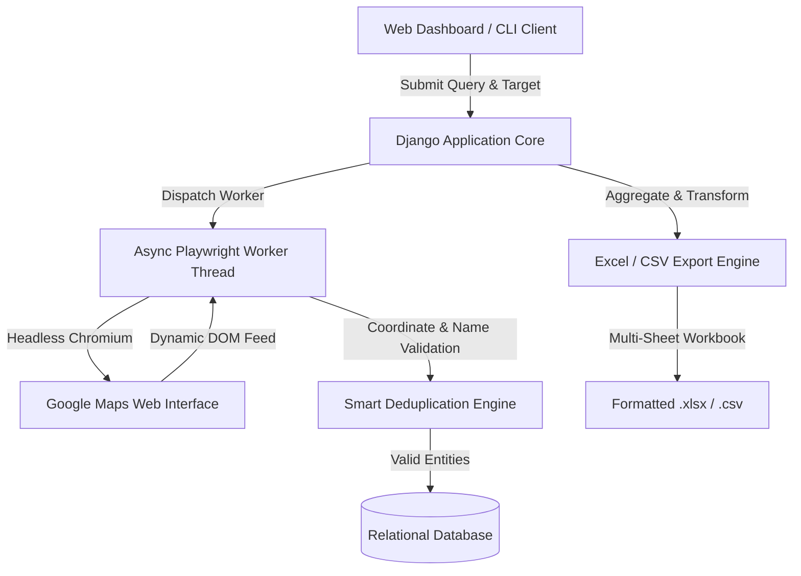

<div align="center">

# Google Maps Enterprise Scraper
### High-Throughput Business Intelligence & Geospatial Data Extraction Platform

[](https://python.org)
[](https://djangoproject.com)
[](https://playwright.dev)
[](https://docker.com)
[](https://microsoft.com)

<p align="center">
  A production-grade web scraping and business intelligence suite built with Django, Playwright, Pandas, and OpenPyXL. Engineered for high-accuracy extraction of public commercial listings with branch-aware deduplication and multi-sheet workbook generation.
</p>

[System Architecture](#system-architecture) |
[Key Capabilities](#key-capabilities) |
[Data Schema](#data-schema) |
[Installation](#installation) |
[CLI Usage](#cli-usage) |
[Production Deployment](#production-deployment) |
[Excel Formatting](#excel-workbook-architecture)

---

</div>

## Executive Summary

Google Maps Enterprise Scraper is designed to systematically collect, validate, and structure business data from Google Maps at scale. The platform overcomes standard web extraction hurdles including infinite-scroll rendering, dynamic DOM virtualization, anti-scraping countermeasures, and multi-branch ambiguity.

The platform provides dual interfaces: a modern web dashboard featuring real-time telemetry and asynchronous polling, alongside a standalone command-line interface (CLI) suitable for headless servers, cron jobs, and data pipeline orchestration.

---

## System Architecture



---

## Key Capabilities

### Multi-Category Concurrent Batch Scraping
- Batch-process up to 30 distinct commercial categories simultaneously or ingest custom keyword lists.
- Queries are executed independently per category to prevent target-quota fragmentation, guaranteeing comprehensive depth for every selected industry.

### Exhaustive Extraction Mode
- Choose between strict numerical quotas (e.g., 50, 100 per category) or Full-Exhaustion Mode (`target_count = 0`).
- Simulates realistic mouse-wheel trajectories and dynamic wait thresholds until the feed reaches the terminal state (*"You've reached the end of the list"*).

### Branch-Aware Deduplication Engine
- Traditional scrapers erroneously discard legitimate business branches sharing identical brand names.
- Our algorithm applies compound identity hashing: a record is skipped **only if both the Place Name and Geographical Coordinates (Latitude/Longitude) collide**. Distinct outlets, franchises, and regional branches are preserved intact.

### Graceful Scraping Interruption
- Control long-running jobs via the interactive interruption interface.
- Utilizes thread-safe signal flags to cleanly terminate browser instances (`browser.close()`), release memory allocations, and finalize status states without sacrificing data harvested prior to the signal.

### Multi-Sheet Formatted Workbook Generator
- **Master Sheet (`Semua Data`)**: Compiles 100% of captured records with executive styling, auto-adjusted column dimensions, and clickable map links.
- **Categorized Sub-sheets**: Automatically segregates records into individual tabs by normalized classification.
- **Aggregation Tab (`Kategori Lainnya`)**: Consolidates niche micro-categories to maintain responsive file sizes and navigation efficiency in large datasets.
- **Universal CSV Compatibility**: Outputs UTF-8 with Byte Order Mark (`utf-8-sig`) for immediate compatibility with spreadsheet software across all operating systems.

---

## Data Schema

The platform extracts and standardizes 14 granular data attributes per location:

| Field Name | Type | Description | Sample Value |
| :--- | :--- | :--- | :--- |
| `No` | Integer | Sequential record index | `1` |
| `Nama Tempat` | String | Official registered trade name | `Kenangan Heritage Roastery` |
| `Kategori` | String | Primary business classification | `Coffee Shop` |
| `Kecamatan` | String | Sub-district administrative division | `Kebayoran Baru` |
| `Rating` | Float | Public aggregate rating score | `4.8` |
| `Jumlah Ulasan` | Integer | Total count of published user reviews | `1850` |
| `Alamat` | Text | Full physical street address | `Jl. Senopati No. 12, Jakarta Selatan` |
| `No Telepon` | String | Contact phone or mobile line | `+62 812-3456-7890` |
| `Website` | URL | Official homepage or web portal | `https://example.com` |
| `Link Google Maps`| URL | Direct canonical Google Maps URL | `https://maps.google.com/?cid=...` |
| `Latitude` | Float | WGS84 Geographical Latitude | `-6.229728` |
| `Longitude` | Float | WGS84 Geographical Longitude | `106.807441` |
| `Kata Kunci` | String | Search query executed during capture | `Coffee Shop di Jakarta Selatan` |
| `Waktu Ditemukan` | Datetime | Record discovery timestamp | `2026-09-11 12:00:00` |

---

## Technical Specifications

- **Backend Framework**: Django 6.1+ (Python 3.10 - 3.12)
- **Browser Automation**: Playwright Chromium (Headless, Sandboxed)
- **Data Engineering**: Pandas, NumPy
- **Spreadsheet Generation**: OpenPyXL (OpenXML Standards Compliant)
- **Frontend Architecture**: Vanilla HTML5, Modern CSS (Glassmorphism), Pure JavaScript (ES6+)
- **Iconography**: Lucide Icons Core (Clean vector graphics, zero emojis)
- **Containerization**: Multi-stage Dockerfile with bundled Chromium shared libraries

---

## Installation

### Prerequisites
- Python 3.10 or higher
- Git
- Modern terminal environment (PowerShell, Bash, or Zsh)

### Step-by-Step Setup

1. **Clone the repository:**
   ```bash
   git clone https://github.com/faizarfi/scraping.git
   cd scraping
   ```

2. **Initialize and activate virtual environment:**
   ```bash
   # Windows
   python -m venv .venv
   .venv\Scripts\activate

   # Linux / macOS
   python3 -m venv .venv
   source .venv/bin/activate
   ```

3. **Install dependencies and Playwright browser binaries:**
   ```bash
   pip install --upgrade pip
   pip install -r requirements.txt
   playwright install chromium
   ```

4. **Execute database migrations:**
   ```bash
   python manage.py migrate
   ```

5. **Launch the web application:**
   ```bash
   python manage.py runserver 127.0.0.1:8000
   ```
   Access the dashboard at `http://127.0.0.1:8000`.

---

## CLI Usage

For programmatic workflows, batch automation, or headless environments, use `cli_scraper.py`:

```bash
# General extraction with default parameters
python cli_scraper.py --query "Coffee Shop di Jakarta Selatan" --limit 50 --output coffee_jakarta.xlsx

# Export directly to CSV format
python cli_scraper.py --query "Restoran di Bandung" --limit 100 --output restaurants_bandung.csv

# Run with visible Chromium window for debugging
python cli_scraper.py --query "Hotel di Surabaya" --limit 25 --output hotels_surabaya.xlsx --headful
```

### Command Flags
| Argument | Short | Type | Description | Default |
| :--- | :--- | :--- | :--- | :--- |
| `--query` | `-q` | String | Target keyword or phrase | *(Required)* |
| `--limit` | `-l` | Integer| Target record limit | `30` |
| `--output`| `-o` | String | Output destination (`.xlsx` or `.csv`) | `places.xlsx` |
| `--headful` | | Flag | Render visible browser window | `False` |

---

## Production Deployment

### Docker Deployment

The project includes a self-contained `Dockerfile` preconfigured with Python 3.12, system-level audio/video codecs, X11 libraries, and Playwright Chromium binaries:

```bash
# Build and run container in detached mode
docker compose up -d --build
```
Access the service at `http://<SERVER_IP>:8000`.

### Linux VPS Deployment (Ubuntu / Debian)

1. **Provision system dependencies:**
   ```bash
   sudo apt update && sudo apt install -y python3-pip python3-venv git curl
   ```

2. **Clone codebase and install requirements:**
   ```bash
   git clone https://github.com/faizarfi/scraping.git /var/www/scraper
   cd /var/www/scraper
   python3 -m venv .venv
   source .venv/bin/activate
   pip install -r requirements.txt
   playwright install --with-deps chromium
   ```

3. **Prepare static assets and schema:**
   ```bash
   python manage.py migrate
   python manage.py collectstatic --noinput
   ```

4. **Run via Gunicorn WSGI Server:**
   ```bash
   gunicorn config.wsgi:application --bind 0.0.0.0:8000 --workers 2 --timeout 180
   ```

### Cloud Platform Support (Railway / Render / Fly.io)

1. Connect the GitHub repository directly to your platform provider.
2. The platform will parse `Dockerfile` and `Procfile` automatically.
3. Configure environment variables in the project settings:
   - `DJANGO_DEBUG` = `False`
   - `DJANGO_ALLOWED_HOSTS` = `*`
   - `DJANGO_SECRET_KEY` = `<production-secret-key>`

---

## Excel Workbook Architecture

The generator builds structured Microsoft Excel workbooks adhering to OpenXML specifications:

```
[ Output Workbook: export_data.xlsx ]
|
+-- [ Sheet: Semua Data ]         (Master sheet: 100% of extracted entities)
|
+-- [ Sheet: Cafe ]               (Dedicated sub-sheet: Filtered by category)
+-- [ Sheet: Restoran ]           (Dedicated sub-sheet: Filtered by category)
+-- [ Sheet: Apotek ]             (Dedicated sub-sheet: Filtered by category)
|
+-- [ Sheet: Kategori Lainnya ]   (Consolidation sheet: Low-frequency classifications)
```

**Styling Specifications:**
- Header Fill: Deep Slate (`#1E293B`)
- Header Typography: Segoe UI, 11pt Bold, Pure White (`#FFFFFF`)
- Cell Borders: Thin Gridlines (`#CBD5E1`)
- Column Layout: Automated length calculation with min-max clamping (12 to 45 units)
- Hyperlinks: Active URL references formatted in Royal Blue (`#2563EB`) with single underline

---

## Legal & Compliance

This tool is engineered for authorized data auditing, business intelligence, and research into publicly available directories. Users must ensure compliance with applicable terms of service, robots.txt directives, and local data collection regulations.

Maintained by [faizarfi](https://github.com/faizarfi).
